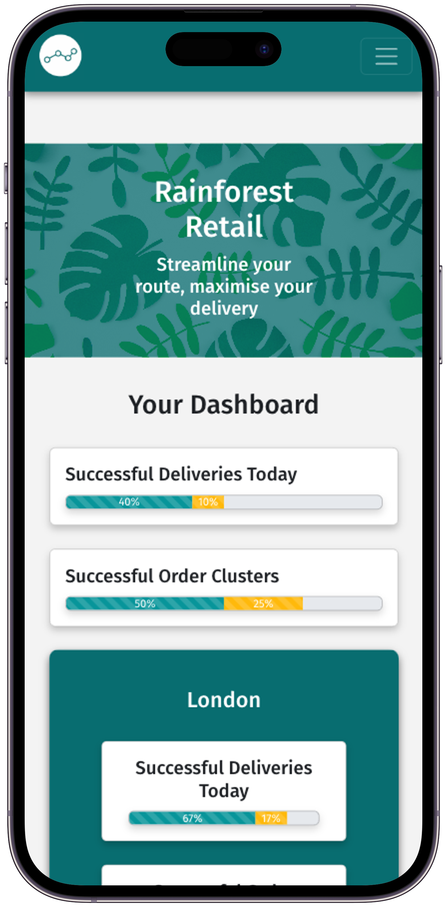
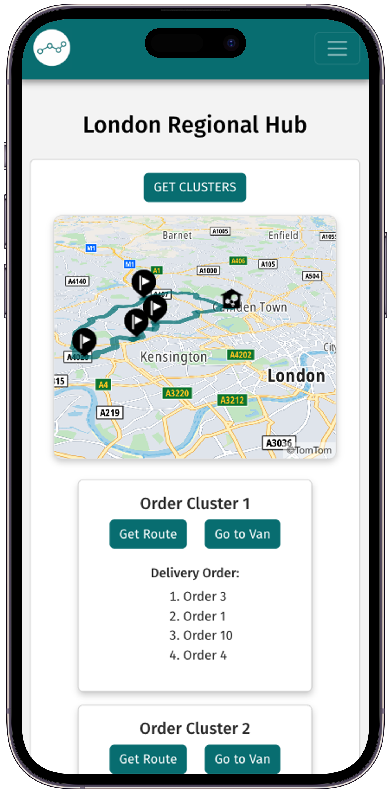

# Rainforest Retail - Deliveries

## Rainforest Retail's Problem
Rainforest Retail's delivery system is currently experiencing a significant bottleneck due to its reliance on a single warehouse. This centralised approach results in inefficiencies, delays and increased delivery times. Consequently, the fleet of delivery vehicles is being poorly utilised.

## Our Solution

To alleviate the pressure on the delivery network, the single warehouse will be replaced with regional hubs. This decentralised model will bring distribution points closer to customers, reducing delivery times and enabling a more responsive and flexible logistics system. To optimise this setup, a clustering algorithm group orders per regional hub into a cluster or orders a van will deliver. Additionally, the clustered order data will be fed into a waypoint optimiser, which will determine the most efficient routes for each van. This approach will improve the utilisation of the delivery fleet, reduce operational costs, and improve overall customer satisfaction by providing faster and more reliable deliveries.

{width=250} {width=250}

## Tech Stack
#### Back-end
- Java 17
- Spring Boot
- Apache Commons Math
- PostgreSQL
- Hibernate

#### Front-end
- JavaScript
- React
- React Bootstrap
- OpenWeather API
- TomTom API


## Installation Instructions

**1. Install Dependencies**
Install Java 17, JavaScript and PostgreSQL

**2. Fork the repostiory**
Install Java 17, JavaScript and PostgreSQL

**3. Create Database**
Create your local database by running
`createdb postgresql`
in your terminal.

**4. Run the back-end server**
Open your IDE of choice, and run RainforestRetailServerApplication.java

**5. Create API keys**
Get the API keys for the TomTom API and OpenWeatherAPI

**5. Create .env file**
Create the .env file by typing in 
`touch .env`
in the your terminal, opened in the client folder. Open this file and enter the following
```
VITE_TOMTOM_API = <your key here>
VITE_TOMTOM_API_URL = https://api.tomtom.com
VITE_OPENWEATHER_API = <your key here>
```
Save the file.

**6. Install front-end packages**
Open your terminal in the client folder and enter
`npm install`

**7. Run your front-end**
Open your terminal in the client folder and enter
`npm run dev`

**8. Open the app**
Open your browser and go to localhost:5173.

## Authors

|    Name     |         Github              |
|---------|---------------------------------|
| Gellila     | https://github.com/gellilazeru|
| Sunny   | https://github.com/SunnyMudhar    |
| Tom   | https://github.com/thomaspeace   |
| Zuhair   | https://github.com/KhanZuh  |
